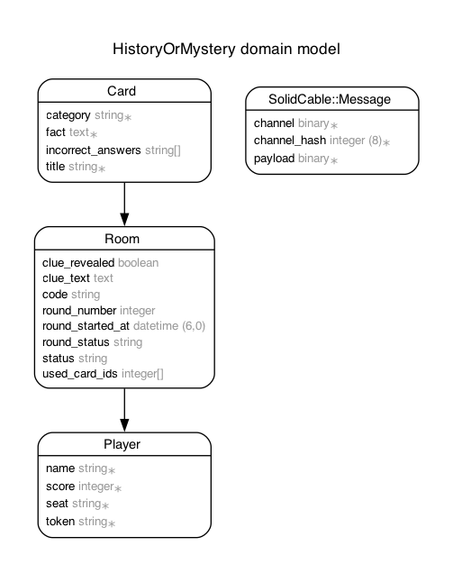
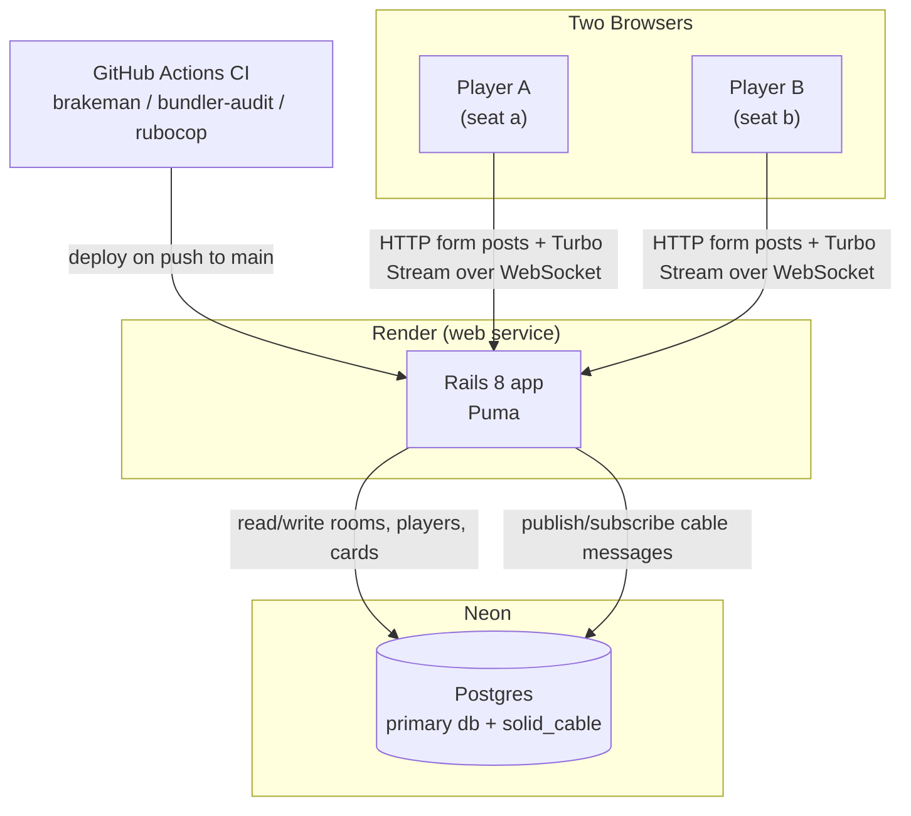
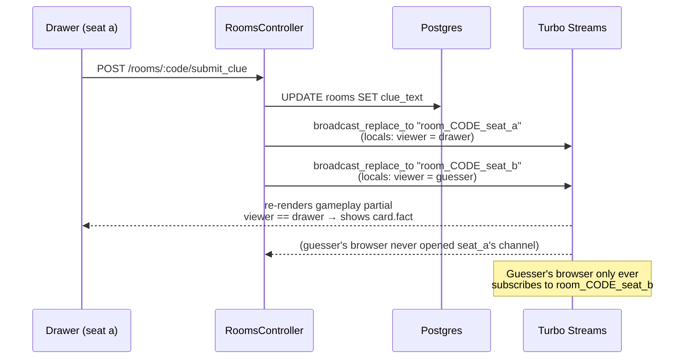

<h1 align="center">
  <br>
    
  <br>
  History or Mystery?
  <br>
</h1>

<p align="center">A real-time, two-player charades-style trivia game built with Rails 8, Postgres, and Action Cable / Turbo Streams.</p>

<p align="center"><a href="https://history-or-mystery.onrender.com"><strong>▶ Play it live</strong></a></p>

## Number of Players: 
2

## How to Play
One player (the host) creates a room and shares the room code with the other player. Each round, one player is the **drawer** and the other is the **guesser**:

1. The drawer is shown a fact and its answer (e.g. fact: *"The last moon landing was in 1972"* → answer: *"Apollo 17 Mission"*).
2. The guesser asks to be "clued in," which reveals a text box to the drawer.
3. The drawer types a one-word clue (no giving away the answer directly) and submits it.
4. The guesser sees the clue and tries to guess out loud. The drawer marks the round **Correct** or **Incorrect**, and the guesser can **Forfeit**.
5. Seats swap drawer/guesser each round. The game runs for 3 rounds, then ends.

## Gameplay
**How this works:**
<ul>
<li>Player 1 draws a card: History: The last moon landing was in 1972</li>
<li>Player 2 asks a question (clued in): What year did it take place?</li>
<li> Player 1: 1972 </li>
<li> Player 2: Is war involved? </li>
<li> Player 1: No</li>
<li> Player 2: Does the event take place in America?</li>
<li> Player 1: Not necessarily </li>
<li> Player 2: Space race? </li>
<li> Player 1: Yes! </li>
<li> Player 2: The Apollo 17 Mission?</li>
<li> Player 1: Correct! *reveals card* </li>
</ul>


## ERD Diagram
<br>
    
<br>

## Architecture



Players are anonymous: joining or creating a room issues a signed, `httponly` cookie holding a per-player token (`has_secure_token`), read on each request via `ActiveSupport::CurrentAttributes` (`Current.player`). There's no login auth system the player's identity lives entirely in that cookie for the duration of the game room.

### The core design decision: per-seat broadcasting

The guesser must never be able to see the fact, even by inspecting the page source or the WebSocket frames. A single shared Turbo Stream per room would leak the fact to both players' browsers, relying on the view to *hide* it rather than never *send* it. Instead, every state change broadcasts twice, once per seat, to two separate streams, and each stream is rendered with that player's own view of the room:



The fact simply never reaches the guesser's browser because it isn't rendered into HTML that gets sent to them, so there's nothing to leak client-side. This means broadcast-context views can't rely on `@room` or `Current.player` (those only exist inside a real HTTP request); every broadcast passes `room` and `viewer` explicitly through the controller and the whole partial chain.

## Tech stack

- **Rails 8.1**, Ruby 4.0.6
- **PostgreSQL** (Neon), used for both the primary database and Solid Cable's message store
- **Action Cable + Turbo Streams** for real-time updates
- **Solid Cable** (DB-backed Action Cable adapter — no separate Redis dependency)
- **OpenTDB** (Open Trivia Database) as the source of facts, seeded via a rake task
- **Render** for hosting (free-tier web service), deployed from `main` via GitHub Actions

## Local setup

```bash
git clone <repo-url>
cd history_or_mystery
bin/setup          # bundle install, db:prepare, clears logs/tmp, starts bin/dev
```

Requires a local Postgres instance reachable per `config/database.yml`, and `RAILS_MASTER_KEY` set (via `config/master.key` or the `RAILS_MASTER_KEY` env var) to boot at all.

Seed the trivia cards from OpenTDB:

```bash
bin/rails generate_facts
```

## Deployment

Defined in `render.yaml`: one Render web service running `bin/render-build.sh` (bundle install, asset precompile, `db:prepare`) and `bin/render-start.sh` (`puma`) and a Neon Postgres database via `DATABASE_URL`. Every push to `main` that passes CI (`scan_ruby`, `scan_js`, `lint`) triggers a Render auto-deploy.

## Known limitations & future improvements

These are the future improvements I would make and gaps I identified:

- **Automated test coverage.** `scan_ruby`, `scan_js`, and `lint` run in CI; however, the Rails test suite and system tests are scaffolded but currently disabled in CI.
- **No reconnect/disconnect handling.** If a player closes their tab mid-round, the room just sits idle. There's no timeout and no "player left" notice.
- **No room expiry/cleanup or appwide garbage collection.** Finished and abandoned rooms accumulate in the database indefinitely; there's no background job clearing them out. I manually remove the abandoned rooms from the database.
- **Stale trivia cards.** I added a configuration to run a Render cronjob to refresh the cards; however, Render's free-tier charges for cron job service. I am manually seeding the database with more trivia cards while I find another alternative.
- **Fixed 3-round game length, single clue per round, and varied question difficulties.** Difficulty levels (OpenTDB has a `difficulty` field), a three-clue system, and a multiple-choice answer mode were all considered and deferred for future implementation. Difficulty levels vary, making certain questions significantly harder than others. 
- **No visible scoreboard.** Player names are tracked in the database and scores are incremented correctly, but are not displayed in the UI. Currently, a player has no way to see the score mid-game.
- **Additional game modes.** (Time challenge mode) that introduces time constraints. The guesser will have 90 seconds to make a guess. If they run out of time, it's an automatic forfeit. 
- **Client-side resync fallback** `resync_controller.js` is a Stimulus controller scoped to the room page. It listens for the tab regaining visibility or being restored from the browser's back-forward cache, and it also runs a periodic timer (every 10 seconds) that forces a fresh `Turbo.visit` regardless of visibility. THis is because a connection can die silently even while the tab stays fully visible and awake. It re-fetches the page and re-establishes the Action Cable subscription. The drawer's in-progress clue input is marked `data-turbo-permanent` so a resync mid-typing doesn't remove unsaved text.